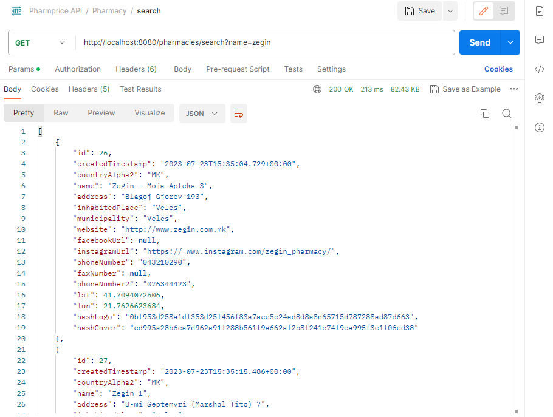
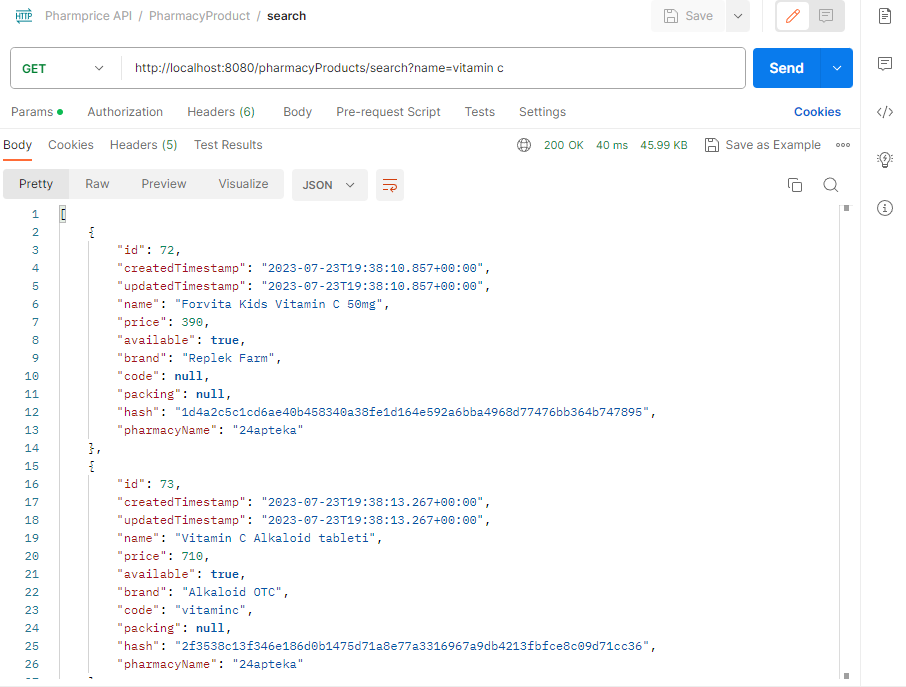

# Pharmprice

Pharmprice is a web application that allows users to search for pharmacies and their respective product prices. The application is built using the Spring framework for the back-end and provides an interface to search for pharmacies on the map and compare prices of products from different pharmacies.

## Table of Contents

- [Features](#features)
- [Technologies Used](#technologies-used)
- [Installation](#installation)
- [API Endpoints](#api-endpoints)
- [Contributing](#contributing)
- [License](#license)

## Features

- Search for nearby pharmacies on the map.
- View the locations of pharmacies on an interactive map.
- Search for product prices from different pharmacies.
- Compare prices of products from multiple pharmacies.

## Technologies Used

- Spring Framework
- Java

## Installation

1. Clone the repository: `git clone https://github.com/your-username/pharmprice.git`
2. Navigate to the project directory: `cd pharmprice`

## API Endpoints

- **`GET /pharmacies/search`**: Retrieve a list of pharmacies.
    - Parameters:
        - `name`: The name of the pharmacy.

- **`GET /pharmacyProducts/search`**: Get the list of products from different pharmacies.
    - Parameters:
        - `name`: The name of the product.

## Contributing

We welcome contributions to Pharmprice. If you want to contribute, please follow these steps:

1. Fork the repository.
2. Create a new branch: `git checkout -b feature/your-feature-name`
3. Make your changes and commit them: `git commit -m 'Add some feature'`
4. Push the changes to your fork: `git push origin feature/your-feature-name`
5. Submit a pull request to the `main` branch of the original repository.

## License

This project is licensed under the <u><b>MIT License</b></u>.
